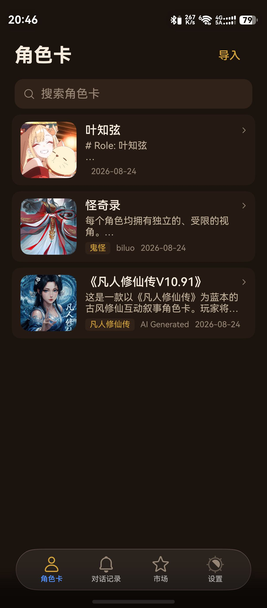
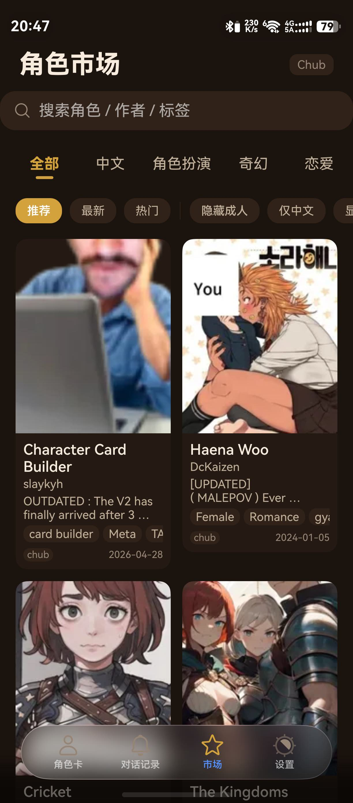
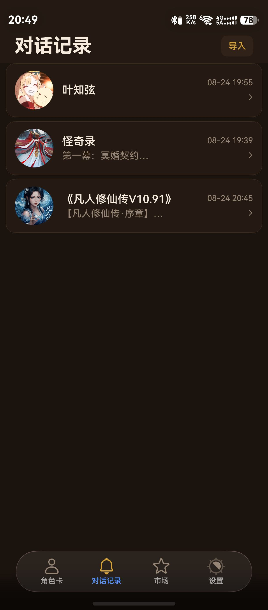
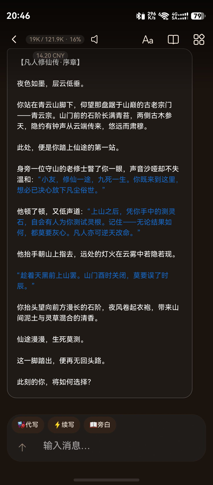
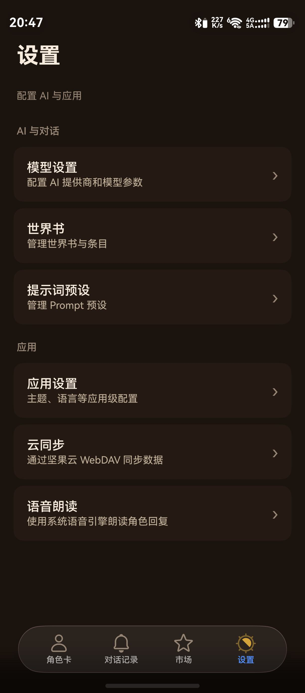

# ArkTavernSolo

[](https://developer.huawei.com/consumer/cn/deveco-studio/)
[](https://developer.huawei.com)
[](https://platform.openai.com)
[](./LICENSE)

**English:** A native **HarmonyOS NEXT** AI **character roleplay** chat client built with **ArkTS** / **ArkUI**. Inspired by **SillyTavern**, it supports **Tavern Card V2/V3** (JSON/PNG) import & export, AI character card generation and editing, conversation branching, world lorebook, long-term memory, OpenAI-compatible model providers (DeepSeek, etc.), TTS, WebDAV sync and multiple themes.

**中文:** 原生 HarmonyOS NEXT AI 角色扮演聊天客户端（单人对话），参考 [SillyTavern](https://github.com/SillyTavern/SillyTavern) 的核心玩法，使用 ArkTS / ArkUI 从零实现，鸿蒙酒馆。

> 与完整版 ArkTavern（含群聊/世界/AvatarAI/VRM）相比，Solo 是专注于单人对话体验的精简版，两者数据完全隔离。

## 截图预览

| 角色卡 | 角色市场 |
| :---: | :---: |
|  |  |

| 对话记录 | 聊天界面 |
| :---: | :---: |
|  |  |

| 设置 |
| :---: |
|  |

## 功能特性

### 角色卡
- Tavern Card **V2 / V3** 规范，支持 **JSON / PNG** 导入导出
- PNG 角色卡解析（内嵌 chara 数据块）、V2 卡自动修复与校验
- **AI 生成角色卡**：一句话描述生成完整角色卡
- **AI 优化角色卡**：仅整理结构（不改设定）/ 深度改写（丰富内容）双模式
- 角色市场：浏览 / 在线下载角色卡

### 对话
- **对话分支**：从任意历史消息分叉、重新生成回复，分支地图可视化（缩放/平移/点击切换）
- 消息 Swipe：一条消息多个候选回复，左右切换
- 历史消息编辑、删除后继续、旁白（narrator）、AI 代写（impersonate）
- 聊天背景：自定义图片 + 模糊度 / 暗化调节

### Prompt 工程
- Prompt 预设模板（可自定义顺序与启用）
- 宏替换系统（`{{user}}` / `{{char}}` 等）
- 上下文预算：Token 估算与预算控制
- 世界书（Lorebook）：关键词触发注入
- 长期记忆：对话摘要生成与管理

### 模型与语音
- 多模型配置：兼容 OpenAI 风格 Chat Completions API，支持 DeepSeek 等
- 思考强度（reasoning_effort）按会话配置
- TTS 语音朗读：Edge 在线 TTS，消息级朗读
- 用户人设（Persona）管理

### 数据
- 聊天归档导入 / 导出（JSON）
- 坚果云 WebDAV 云同步（端到端加密 API Key）
- 多主题：亮 / 暗 / 酒馆棕

## 技术栈

| 项 | 值 |
|---|---|
| 平台 | HarmonyOS NEXT（API 24 / SDK 6.1.1） |
| 语言 | ArkTS |
| UI 框架 | ArkUI 声明式 |
| 存储 | 关系型数据库（relationalStore / RDB） |
| IDE | DevEco Studio 6+ |

## 构建

1. 安装 [DevEco Studio](https://developer.huawei.com/consumer/cn/deveco-studio/) 6.0 及以上
2. Clone 本仓库并打开
3. `File → Project Structure → Signing Configs` 配置自己的调试签名（仓库内签名材料仅对本机有效）
4. 连接真机或启动模拟器，点击 Run

> 无需额外依赖安装，oh_modules 会由 hvigor 自动解析。

## 目录结构

```
entry/src/main/ets/
├── components/     # 可复用 UI 组件（不访问网络/数据库）
├── database/       # RDB 建表 / 迁移（版本化迁移框架）
├── models/         # 纯数据模型
├── pages/          # 页面与 Tab 根视图
├── parser/         # 角色卡 / 归档 解析器
├── repositories/   # 数据仓库层（SQL 封装）
├── services/       # 业务服务（ChatService / 记忆 / 同步 / TTS / AI ...）
├── theme/          # 主题调色板
├── utils/          # 工具类
└── viewmodels/     # 视图模型
```

分层约定：`pages → viewmodels → services → repositories → database`，components 与 models 不含业务副作用。

## License

[MIT](./LICENSE)
